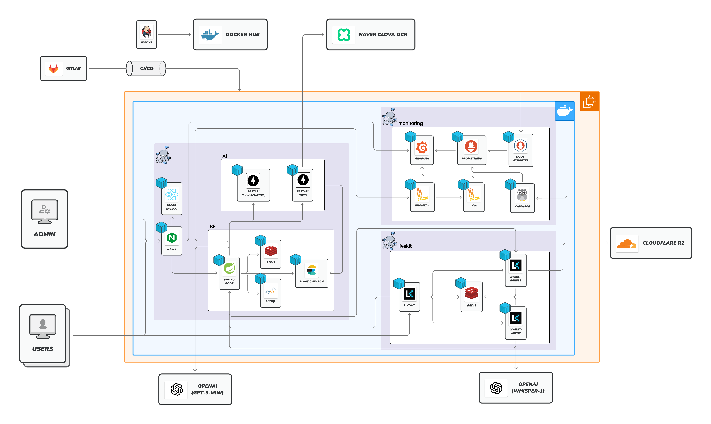

<div align="center">

# MENTO

### ✨ 남성 뷰티 입문자를 위한 AI 기반 맞춤형 상담 플랫폼 ✨

</div>

---

## 📋 목차

- [📖 프로젝트 개요](#-프로젝트-개요)
- [🏗️ 아키텍처](#️-아키텍처)
- [📁 프로젝트 구조](#-프로젝트-구조)
- [🤝 협업 가이드](#-협업-가이드)
  - [Ground Rule](#-ground-rule)
  - [브랜치 전략](#-브랜치-전략)
  - [커밋 컨벤션](#-커밋-컨벤션)
  - [데일리 스크럼](#-데일리-스크럼)
- [📚 상세 문서](#-상세-문서)

---

# 📖 프로젝트 개요

> [!IMPORTANT]
> **MENTO**는 남성 뷰티 입문자를 위한 AI 기반 맞춤형 상담 플랫폼입니다.

**프로젝트 기간:** 2026.01.06 - 2026.02.08 (SSAFY 14기 특화 프로젝트)

**주요 목표:**
- 🎯 남성 뷰티 입문자를 위한 진입 장벽 해소
- 🤝 전문 멘토와의 실시간 1:1 화상 상담
- 🤖 AI 기반 피부 분석 및 맞춤형 리포트 제공
- 📦 개인 맞춤형 제품 관리 및 추천

---

# 🏗️ 아키텍처

## 전체 시스템 아키텍처

<div align="center">



</div>

> [!NOTE]
> MENTO는 모놀리식 아키텍처 기반으로 설계되었으며, Docker Compose를 통해 각 서비스를 오케스트레이션합니다.

**주요 구성 요소:**
- **Frontend (React 19)**: SPA 기반 사용자 인터페이스
- **Backend (Spring Boot 4)**: RESTful API 서버 (CQRS 패턴)
- **AI Server (FastAPI)**: ONNX 기반 피부 분석 추론 서버
- **LiveKit**: WebRTC 기반 실시간 화상 상담
- **Nginx**: 리버스 프록시 및 SSL/TLS 종료
- **MySQL**: 메인 데이터베이스
- **Redis**: 캐싱 및 세션 관리
- **Elasticsearch**: 전문 검색 엔진
- **Monitoring Stack**: Grafana + Prometheus + Loki

---

# 📁 프로젝트 구조

```
S14P11A704/
├── backend/          # Spring Boot 백엔드
│   └── README.md     # 백엔드 상세 문서
├── frontend/         # React 프론트엔드
│   └── README.md     # 프론트엔드 상세 문서
├── ai/              # AI 피부 분석 서버
│   └── skin-analysis/NIA/
│       └── README.md # AI 상세 문서
└── infra/           # 인프라 설정
    └── README.md     # 인프라 상세 문서
```

**상세 문서:**
- [Backend README](backend/README.md) - Spring Boot 백엔드 개발 가이드
- [Frontend README](frontend/README.md) - React 프론트엔드 개발 가이드
- [AI Skin Analysis README](ai/skin-analysis/NIA/README.md) - AI 피부 분석 시스템 가이드
- [Infrastructure README](infra/README.md) - 인프라 및 CI/CD 가이드

---

# 🤝 협업 가이드

## 📜 Ground Rule

### Project

> [!IMPORTANT]
> 프로젝트 진행 시 반드시 지켜야 할 기본 원칙입니다.

1. **Issue 관리 자세히 하기!**
   - Jira 티켓을 상세하게 작성하고 관리합니다
   - 작업 진행 상황을 실시간으로 업데이트합니다

2. **BE / FE 간 소통 잘 하기**
   - API 명세 변경 시 사전에 공유합니다
   - 파트 간 의존성이 있는 작업은 미리 협의합니다

3. **마감 기한 잘 지키기**
   - Sprint 일정을 준수합니다
   - 지연 예상 시 즉시 팀원에게 공유합니다

4. **문서 작업 템플릿 지키기**
   - 커밋 컨벤션, 브랜치 네이밍 규칙을 준수합니다
   - README 및 문서 작성 시 정해진 형식을 따릅니다

### Scrum Rule

> [!NOTE]
> 데일리 스크럼 및 회의 진행 시 지켜야 할 규칙입니다.

1. **회의할 땐 무조건 존댓말**
   - 모든 회의에서 상호 존중을 위해 존댓말을 사용합니다

2. **메시지 잘 확인 후 이모지!!**
   - 중요 메시지 확인 시 이모지로 응답합니다
   - 소통의 명확성을 높이고 확인 여부를 표시합니다

3. **취업 활동 일정 공유하기**
   - 면접, 코딩테스트 등 취업 관련 일정을 미리 공유합니다
   - 팀원의 일정을 배려하여 회의 시간을 조율합니다

### Mind Set

> [!TIP]
> 팀워크를 위해 함께 지향하는 마인드셋입니다.

1. **서로 존중하며 대화하기 😄**
   - 다른 의견을 경청하고 존중합니다
   - 긍정적인 태도로 소통합니다

2. **언제나 당당하게 말하기**
   - 모르는 것은 부끄러워하지 않고 질문합니다
   - 자신의 의견을 명확하게 표현합니다

3. **책임감을 가지고 최선을 다하기!**
   - 맡은 작업에 대해 끝까지 책임집니다
   - 팀 목표 달성을 위해 최선을 다합니다

---

## 🌿 브랜치 전략

### 브랜치 구조

```
main - develop - develop-{파트} - feature/hotfix{티켓}
```

### 1️⃣ main
- 프로젝트 종료와 함께 이전되는 **최종 배포 브랜치**
- `tag` 기능으로 배포 버전을 관리

### 2️⃣ develop
- 주간 Sprint 종료와 함께 갱신되는 **기능 통합 브랜치** (default 브랜치)
- Sprint 단위로 FE/BE의 작업 내역을 통합하여 관리
- 실제 배포는 `develop-{파트}`에서 진행되므로, 코드 이력 관리 목적으로만 사용
- Sprint 종료 시 `develop-{파트}` → `develop` **squash and merge**
- 프로젝트 종료 시 `develop` → `main` **merge**

### 3️⃣ develop-{part}
- 파트별 독립 개발 및 배포 브랜치 (`develop-fe` / `develop-be` / `develop-ai` / `develop-infra`)
- 작업 시작 전 origin `develop-{파트}`에서 fetch, pull 받아서 local 최신화
- FE/BE Commit 기록이 섞이는 불편함을 제거하기 위해 파트별로 분리
- 각 파트별로 독립적인 CI/CD 파이프라인 운영
- `feature` 또는 `hotfix` 브랜치가 **squash and merge**되면 CI/CD 자동 트리거
- Sprint 종료 시 `develop-{파트}` → `develop` **squash and merge**

### 4️⃣ feature
- 기능 개발 브랜치 — `feat/{ticket}`
- 최신화된 local `develop-{파트}`에서 분기하여 작업 시작
- 기능/작업 단위로 브랜치를 관리하고, 코드 충돌을 최소화
- issue 1개당 assignee 1명으로 명확한 책임 소재 관리
- 워크플로우: `feature` push → `develop-{파트}` PR → squash and merge → 자동 배포

### 5️⃣ hotfix
- 긴급 버그 수정 브랜치 — `hotfix/{ticket}`
- `develop-{파트}`에서 분기하여 작업
- 커밋 메시지 prefix: `fix:`
- 운영 중인 서비스의 긴급한 버그를 빠르게 수정
- 워크플로우: `hotfix` push → `develop-{파트}` PR → squash and merge → 자동 배포

### Merge 전략

> [!NOTE]
> 모든 PR은 **squash and merge**로 진행하여 깔끔한 커밋 히스토리를 유지합니다.

### CI/CD 배포

- `develop-fe`: PR merge 시 FE 서버 자동 배포
- `develop-be`: PR merge 시 BE 서버 자동 배포
- `develop-ai`: PR merge 시 AI 서버 자동 배포
- `develop-infra`: 인프라 설정 변경 시 수동 배포
- `develop`: 배포 없음 (주간 스프린트 이력 관리만)
- `main`: 프로젝트 종료 시 최종 배포

---

## ✍️ 커밋 컨벤션

### Gitmoji 사용

> [!IMPORTANT]
> Gitmoji Plugin을 설치하여 일관된 커밋 메시지를 작성합니다.

**Plugin 설치:**
- IntelliJ IDEA: Settings → Plugins → "Gitmoji" 검색 및 설치
- 설정: Use unicode emoji instead of text version 활성화

### 커밋 형식

```
<gitmoji> <type>: <subject>
<body>

Ref. #<jira-ticket>
```

### 주요 Gitmoji

| 아이콘 | 설명 | 원문 |
|:---:|:---|:---|
| ✨ | 새 기능 | Introduce new features. |
| ♻️ | 코드 리팩토링 | Refactor code. |
| 🔥 | 코드/파일 삭제 | Remove code or files. |
| 🐛 | 버그 수정 | Fix a bug. |
| ✅ | 테스트 추가/수정 | Add or update tests. |
| 📝 | 문서 추가/수정 | Add or update documentation. |
| ➕ | 의존성 추가 | Add a dependency. |
| ➖ | 의존성 제거 | Remove a dependency. |
| 🔧 | 구성 파일 추가/삭제 | Add or update configuration files. |
| ⏪ | 변경 내용 되돌리기 | Revert changes. |
| 🚚 | 리소스 이동, 이름 변경 | Move or rename resources. |
| 💡 | 주석 추가/수정 | Add or update comments in source code. |

### 커밋 메시지 규칙

#### 제목 (Subject) 작성 규칙

```bash
✅ ♻️ refactor: Spring AI 호환성 업데이트
❌ ♻️ refactor: Spring AI 호환성 업데이트한다
❌ ♻️ refactor: Spring AI 호환성 업데이트.
```

- 50자 이내 제한 (한글 기준 약 25자)
- 명령형 현재시제 사용 ("추가한다" ❌, "추가" ✅)
- Type 첫 글자 대문자 금지 (소문자 시작)
- 마침표 사용 금지

#### 본문 (Body) 작성 규칙

```bash
- Spring AI 1.0.0 GA 버전 대응 의존성 업데이트
- 불필요한 로그 제거 및 메시지 포맷 개선
```

- (-) 로 내용을 구분
- **왜(Why) 변경했는지** 중심으로 설명
- **무엇을(What) 변경했는지** 구체적으로 나열

#### JIRA Ticket 작성 규칙

```bash
✅ Ref. #S14P11A704-32, #S14P11A704-321
❌ Ref. S14P11A704-32, S14P11A704-321
❌ #S14P11A704-32, #S14P11A704-321
```

- `Ref. #` 접두어 필수
- JIRA 이슈 번호 정확히 기재
- 본문과 한 줄 띄우고 작성

### 커밋 예시

#### Backend 예시

```
♻️ refactor: Spring AI 호환성 업데이트

- Spring AI 1.0.0 GA 버전 대응 의존성 업데이트
- 불필요한 로그 제거 및 메시지 포맷 개선

Ref. #S14P11A704-32
```

#### Frontend 예시

```
✨ feat: 예약 결제 플로우 구현

- 카카오페이 API 연동
- 결제 성공/실패 페이지 구현
- 예약 확정 알림 추가

Ref. #S14P11A704-45
```

#### AI 예시

```
⚡ perf: ONNX 모델 최적화

- 추론 속도 30ms 개선 (108ms → 78ms)
- 메모리 사용량 20% 감소

Ref. #S14P11A704-67
```

---

# 📚 상세 문서

## 개발 가이드

각 파트별 상세 개발 가이드는 아래 README를 참고하세요:

- **[Backend README](backend/README.md)**
  - 기술 스택 (Java 25, Spring Boot 4.0.1)
  - 아키텍처 (CQRS 패턴)
  - API 문서
  - 설치 및 실행 가이드

- **[Frontend README](frontend/README.md)**
  - 기술 스택 (React 19, TypeScript 5)
  - 핵심 기능 (화상 상담, AI 피부 분석)
  - 폴더 구조
  - 개발 환경 설정

- **[AI Skin Analysis README](ai/skin-analysis/NIA/README.md)**
  - 기술 스택 (Python 3.12, FastAPI, ONNX)
  - 모델 학습 파이프라인
  - 성능 리포트
  - 문제 해결 가이드

- **[Infrastructure README](infra/README.md)**
  - 기술 스택 (Docker, Nginx, Jenkins)
  - 컨테이너 오케스트레이션 (Docker Compose)
  - CI/CD 파이프라인
  - 모니터링 (Grafana, Prometheus, Loki)
  - 운영 가이드

## 인프라 & 배포

- **서버**: AWS EC2 (Ubuntu 24.04, 4 vCPU, 15GB RAM)
- **배포**: Docker Compose + Jenkins CI/CD
- **도메인**: https://i14a704.p.ssafy.io
- **모니터링**: https://i14a704.p.ssafy.io/grafana

상세한 인프라 정보는 [Infrastructure README](infra/README.md)를 참고하세요.

---

<div align="center">

### **MENTO - AI 기반 뷰티 상담 플랫폼**

*Made with ❤️ by SSAFY 14th A704 Team*

</div>